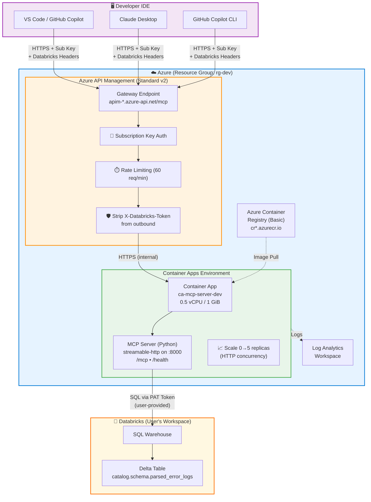
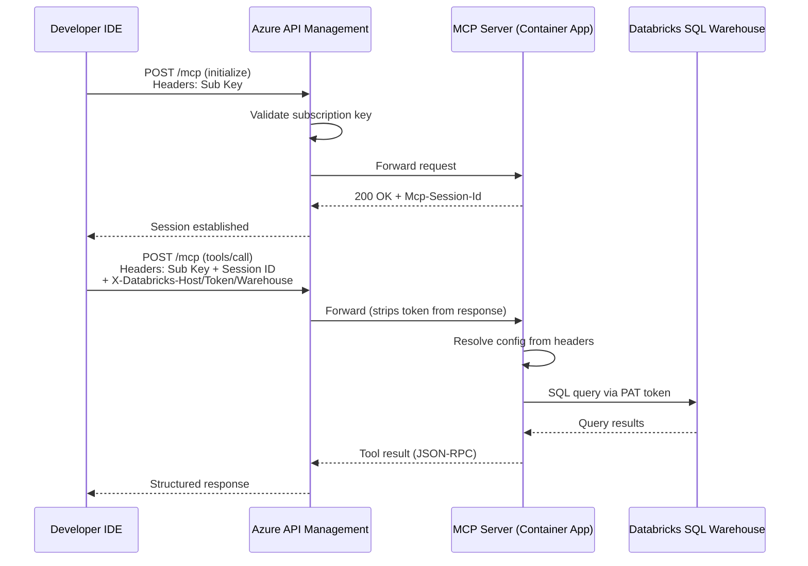

# Azure Deployment Guide

Deploy the Databricks Error Logs MCP Server to Azure with a single command using Azure Developer CLI (`azd`).

## Architecture



### Data Flow



## Resources Created

> **Cost estimate assumes ~10,000 requests/day (~300K/month).** Prices are approximate USD, East US 2 region.

| Resource | SKU/Tier | Approx. Monthly Cost |
|----------|----------|---------------------|
| Resource Group | — | Free |
| Azure Container Registry | Basic (10 GB) | ~$5 |
| Container Apps Environment | Consumption | Free (included) |
| Container App (MCP Server) | 0.5 vCPU / 1 GiB | ~$3-4 ¹ |
| Log Analytics Workspace | Per-GB ingestion | ~$2-5 |
| API Management | Standard v2 | ~$700 ² |
| **Total estimate** | | **~$710-715/mo** |

<details>
<summary>¹ Container App cost breakdown (10K req/day)</summary>

- **300K requests/mo** — covered by 2M free request grant
- **300K vCPU-seconds** (2s avg per request × 0.5 vCPU) — 180K free, 120K billable × $0.000024 = $2.88
- **600K GiB-seconds** (2s avg × 1 GiB) — 360K free, 240K billable × $0.0000031 = $0.74
</details>

<details>
<summary>² APIM Standard v2 pricing notes</summary>

- Base unit: **$700/mo** (~$0.97/hr × 720 hrs), includes 50M API calls
- Additional scale units: $500/mo each (up to 10)
- If APIM cost is a concern, consider using **Basic v2** (~$170/mo) or connecting directly to the Container App endpoint without APIM
</details>

## Prerequisites

1. [Azure CLI](https://learn.microsoft.com/en-us/cli/azure/install-azure-cli) installed
2. [Azure Developer CLI (azd)](https://learn.microsoft.com/en-us/azure/developer/azure-developer-cli/install-azd) installed
3. [Docker](https://docs.docker.com/get-docker/) installed and running
4. An Azure subscription with Contributor access

## One-Click Deploy

```bash
# From the databricks/ directory
cd databricks

# Login to Azure
azd auth login

# Provision and deploy everything
azd up
```

You'll be prompted for:
- **Environment name** (e.g., `dev`, `staging`, `prod`)
- **Azure subscription**
- **Azure location** (e.g., `eastus`, `westus2`)

The command will:
1. Create all Azure resources via Bicep
2. Build the Docker image
3. Push to Azure Container Registry
4. Deploy to Container Apps
5. Configure APIM gateway

This takes approximately 3-5 minutes (plus 10-20 minutes if APIM is provisioned for the first time).

## After Deployment

### Get your endpoints

```bash
azd env get-values
```

Key outputs:
- `APIM_MCP_ENDPOINT` — The URL to configure in your MCP client
- `APIM_GATEWAY_URL` — The APIM gateway base URL

### Get your APIM subscription key

1. Go to the [Azure Portal](https://portal.azure.com)
2. Navigate to your API Management instance
3. Go to **Subscriptions**
4. Copy the primary key for the "Databricks MCP Access" product

### Configure GitHub Copilot (VS Code)

Add to `.vscode/mcp.json` in any workspace where you want Databricks error log tools available:

```json
{
  "servers": {
    "databricksErrorLogs": {
      "type": "http",
      "url": "https://<your-apim>.azure-api.net/mcp",
      "headers": {
        "Ocp-Apim-Subscription-Key": "${input:apim-key}",
        "X-Databricks-Host": "${input:databricks-host}",
        "X-Databricks-Token": "${input:databricks-token}",
        "X-Databricks-Warehouse-Id": "${input:databricks-warehouse-id}",
        "X-Databricks-Catalog": "${input:databricks-catalog}",
        "X-Databricks-Schema": "${input:databricks-schema}"
      }
    }
  },
  "inputs": [
    {
      "type": "promptString",
      "id": "apim-key",
      "description": "APIM Subscription Key",
      "password": true
    },
    {
      "type": "promptString",
      "id": "databricks-host",
      "description": "Databricks workspace URL (e.g. https://adb-xxx.azuredatabricks.net)"
    },
    {
      "type": "promptString",
      "id": "databricks-token",
      "description": "Databricks Personal Access Token",
      "password": true
    },
    {
      "type": "promptString",
      "id": "databricks-warehouse-id",
      "description": "SQL Warehouse ID"
    },
    {
      "type": "promptString",
      "id": "databricks-catalog",
      "description": "Catalog name",
      "default": "dbx_1"
    },
    {
      "type": "promptString",
      "id": "databricks-schema",
      "description": "Schema name",
      "default": "default"
    }
  ]
}
```

Replace `<your-apim>` with your APIM instance name from `azd env get-values`.

> **Important:** Use `"type": "http"` (not `"sse"`). This tells VS Code to use the streamable-http MCP transport, which is the current standard for remote servers.

When you open Copilot chat, VS Code will prompt you for:
1. Your APIM subscription key (masked)
2. Your Databricks workspace URL
3. Your Databricks PAT (masked)
4. Your SQL Warehouse ID
5. Catalog and schema names (defaults pre-filled)

Each user provides their own values — nothing is hardcoded.

### Configure Claude Desktop

Edit your Claude Desktop config (`%APPDATA%\Claude\claude_desktop_config.json` on Windows):

```json
{
  "mcpServers": {
    "databricks": {
      "url": "https://<your-apim>.azure-api.net/mcp",
      "headers": {
        "Ocp-Apim-Subscription-Key": "your-subscription-key",
        "X-Databricks-Host": "https://adb-xxx.azuredatabricks.net",
        "X-Databricks-Token": "dapi...",
        "X-Databricks-Warehouse-Id": "your-warehouse-id",
        "X-Databricks-Catalog": "dbx_1",
        "X-Databricks-Schema": "default"
      }
    }
  }
}
```

> **Note:** Claude Desktop does not support `${input:...}` prompts, so values must be hardcoded in the config file. Alternatively, connect without headers and use the `configure_databricks` tool conversationally at the start of your session.

## Managing the Deployment

```bash
# Redeploy after code changes
azd deploy

# View logs
az containerapp logs show \
  --name ca-mcp-server-<env> \
  --resource-group rg-<env> \
  --follow

# Tear down all resources
azd down
```

## Security Considerations

- **APIM subscription keys** gate access to the MCP endpoint
- **Databricks PAT tokens** are passed via headers and never stored server-side
- **APIM outbound policy** strips `X-Databricks-Token` from response headers
- **HTTPS** is enforced end-to-end (APIM → Container App)
- **Rate limiting** is set to 60 requests/minute per subscription key
- **Container Apps** ingress is external but only accepts traffic forwarded by APIM in production (can be locked down further with IP restrictions)

## Troubleshooting

| Issue | Solution |
|-------|----------|
| `azd up` fails on APIM | APIM Standard v2 takes 10-20 min to provision; retry if timeout |
| 401 Unauthorized | Check APIM subscription key is correct |
| Empty results from tools | Verify Databricks headers are correct; test PAT token directly |
| Container not starting | Check `az containerapp logs show` for startup errors |
| APIM returns 500 | Container App may be scaling from zero; retry after 30s |
