# Azure Deployment Guide

Deploy the Databricks Error Logs MCP Server to Azure with a single command using Azure Developer CLI (`azd`).

## Architecture

```mermaid
graph TB
    subgraph Client["🖥️ Developer IDE"]
        VSCode["VS Code / GitHub Copilot"]
        Claude["Claude Desktop"]
        CLI["GitHub Copilot CLI"]
    end

    subgraph Azure["☁️ Azure (Resource Group: rg-dev)"]
        subgraph APIM["Azure API Management (Standard v2)"]
            APIMGw["Gateway Endpoint<br/>apim-*.azure-api.net/mcp"]
            SubKey["🔑 Subscription Key Auth"]
            RateLimit["⏱️ Rate Limiting (60 req/min)"]
            StripToken["🛡️ Strip X-Databricks-Token<br/>from outbound"]
        end

        subgraph CAE["Container Apps Environment"]
            CA["Container App<br/>ca-mcp-server-dev<br/>0.5 vCPU / 1 GiB"]
            MCP["MCP Server (Python)<br/>streamable-http on :8000<br/>/mcp  •  /health"]
            Scale["📈 Scale 0→5 replicas<br/>(HTTP concurrency)"]
        end

        ACR["Azure Container<br/>Registry (Basic)<br/>cr*.azurecr.io"]
        LAW["Log Analytics<br/>Workspace"]
    end

    subgraph DBX["🔶 Databricks (User's Workspace)"]
        SQL["SQL Warehouse"]
        Delta["Delta Table<br/>catalog.schema.parsed_error_logs"]
    end

    VSCode -- "HTTPS + Sub Key<br/>+ Databricks Headers" --> APIMGw
    Claude -- "HTTPS + Sub Key<br/>+ Databricks Headers" --> APIMGw
    CLI -- "HTTPS + Sub Key<br/>+ Databricks Headers" --> APIMGw

    APIMGw --> SubKey --> RateLimit --> StripToken
    StripToken -- "HTTPS (internal)" --> CA
    CA --> MCP
    MCP -- "SQL via PAT Token<br/>(user-provided)" --> SQL
    SQL --> Delta

    ACR -. "Image Pull" .-> CA
    CAE -. "Logs" .-> LAW

    style Azure fill:#e6f3ff,stroke:#0078d4,stroke-width:2px
    style APIM fill:#fff3e0,stroke:#ff8c00,stroke-width:2px
    style CAE fill:#e8f5e9,stroke:#4caf50,stroke-width:2px
    style DBX fill:#fff8e1,stroke:#ff6f00,stroke-width:2px
    style Client fill:#f3e5f5,stroke:#9c27b0,stroke-width:2px
```



### Data Flow


## Resources Created & Cost Estimates

All prices are approximate USD, East US 2 region. Container App costs assume 0.5 vCPU / 1 GiB, ~2 seconds average processing time per MCP request, and include free monthly grants (180K vCPU-seconds, 360K GiB-seconds, 2M requests per subscription).

### With APIM Standard v2

| Resource | SKU/Tier | 500 req/day | 1K req/day | 5K req/day | 10K req/day |
|----------|----------|------------|-----------|-----------|------------|
| Resource Group | — | Free | Free | Free | Free |
| Container Registry | Basic (10 GB) | $5 | $5 | $5 | $5 |
| Container Apps Env | Consumption | Free | Free | Free | Free |
| Container App | 0.5 vCPU / 1 GiB | ~$0 ¹ | ~$0 ¹ | ~$0 ¹ | ~$4 |
| Log Analytics | Per-GB | ~$2 | ~$3 | ~$4 | ~$5 |
| API Management | Standard v2 | $700 | $700 | $700 | $700 |
| **Monthly Total** | | **~$707** | **~$708** | **~$709** | **~$714** |

### With APIM Basic v2

| Resource | SKU/Tier | 500 req/day | 1K req/day | 5K req/day | 10K req/day |
|----------|----------|------------|-----------|-----------|------------|
| Resource Group | — | Free | Free | Free | Free |
| Container Registry | Basic (10 GB) | $5 | $5 | $5 | $5 |
| Container Apps Env | Consumption | Free | Free | Free | Free |
| Container App | 0.5 vCPU / 1 GiB | ~$0 ¹ | ~$0 ¹ | ~$0 ¹ | ~$4 |
| Log Analytics | Per-GB | ~$2 | ~$3 | ~$4 | ~$5 |
| API Management | Basic v2 | $170 | $170 | $170 | $170 |
| **Monthly Total** | | **~$177** | **~$178** | **~$179** | **~$184** |

### Without APIM (Direct to Container App)

| Resource | SKU/Tier | 500 req/day | 1K req/day | 5K req/day | 10K req/day |
|----------|----------|------------|-----------|-----------|------------|
| Resource Group | — | Free | Free | Free | Free |
| Container Registry | Basic (10 GB) | $5 | $5 | $5 | $5 |
| Container Apps Env | Consumption | Free | Free | Free | Free |
| Container App | 0.5 vCPU / 1 GiB | ~$0 ¹ | ~$0 ¹ | ~$0 ¹ | ~$4 |
| Log Analytics | Per-GB | ~$2 | ~$3 | ~$4 | ~$5 |
| **Monthly Total** | | **~$7** | **~$8** | **~$9** | **~$14** |

<details>
<summary>¹ Container App cost breakdown</summary>

At **5K req/day and below**, all compute stays within the free monthly grants:
- 5K/day = 150K req/mo → 150K vCPU-seconds + 300K GiB-seconds (both under free thresholds)

At **10K req/day**:
- 300K requests/mo — covered by 2M free request grant ($0)
- 300K vCPU-seconds (300K req × 2s × 0.5 vCPU) — 180K free, 120K billable × $0.000024 = $2.88
- 600K GiB-seconds (300K req × 2s × 1 GiB) — 360K free, 240K billable × $0.0000031 = $0.74
- **Total: ~$3.62/mo**
</details>

### Choosing an APIM Tier

APIM is the largest cost driver in this deployment, but it's important to understand that **APIM is a shared platform, not a dedicated resource for this MCP server**:

- **One APIM instance can front multiple MCP servers**, internal APIs, partner integrations, and other backend services across your organization
- Standard v2 includes **50M API calls/month** — at 10K MCP requests/day you're using less than 1% of that capacity
- APIM provides **centralized authentication, rate limiting, usage analytics, and a developer portal** across all your APIs
- If your organization already runs an APIM instance, adding this MCP server is essentially **zero incremental cost**

| Consideration | Standard v2 ($700/mo) | Basic v2 ($170/mo) | No APIM |
|--------------|----------------------|-------------------|---------|
| Subscription key auth | ✅ | ✅ | ❌ |
| Rate limiting | ✅ | ✅ | ❌ |
| VNet integration | ✅ | ❌ | ❌ |
| Scale units | Up to 10 | Up to 2 | N/A |
| Developer portal | ✅ | ❌ | ❌ |
| Multi-API gateway | ✅ Best value at scale | ✅ Good for small teams | N/A |
| Included API calls | 50M/mo | 10M/mo | N/A |

> **Without APIM**, you can connect VS Code directly to the Container App endpoint. The endpoint is still HTTPS-secured and supports the same per-request header-based config. To add access control without APIM, consider [Container Apps EasyAuth](https://learn.microsoft.com/en-us/azure/container-apps/authentication) or IP restrictions.

## Prerequisites

1. [Azure CLI](https://learn.microsoft.com/en-us/cli/azure/install-azure-cli) installed
2. [Azure Developer CLI (azd)](https://learn.microsoft.com/en-us/azure/developer/azure-developer-cli/install-azd) installed
3. [Docker](https://docs.docker.com/get-docker/) installed and running
4. An Azure subscription with Contributor access

## One-Click Deploy

```bash
# From the databricks/ directory
cd databricks

# Login to Azure
azd auth login

# Provision and deploy everything
azd up
```

You'll be prompted for:
- **Environment name** (e.g., `dev`, `staging`, `prod`)
- **Azure subscription**
- **Azure location** (e.g., `eastus`, `westus2`)

The command will:
1. Create all Azure resources via Bicep
2. Build the Docker image
3. Push to Azure Container Registry
4. Deploy to Container Apps
5. Configure APIM gateway

This takes approximately 3-5 minutes (plus 10-20 minutes if APIM is provisioned for the first time).

## After Deployment

### Get your endpoints

```bash
azd env get-values
```

Key outputs:
- `APIM_MCP_ENDPOINT` — The URL to configure in your MCP client
- `APIM_GATEWAY_URL` — The APIM gateway base URL

### Get your APIM subscription key

1. Go to the [Azure Portal](https://portal.azure.com)
2. Navigate to your API Management instance
3. Go to **Subscriptions**
4. Copy the primary key for the "Databricks MCP Access" product

### Configure GitHub Copilot (VS Code)

Add to `.vscode/mcp.json` in any workspace where you want Databricks error log tools available:

```json
{
  "servers": {
    "databricksErrorLogs": {
      "type": "http",
      "url": "https://<your-apim>.azure-api.net/mcp",
      "headers": {
        "Ocp-Apim-Subscription-Key": "${input:apim-key}",
        "X-Databricks-Host": "${input:databricks-host}",
        "X-Databricks-Token": "${input:databricks-token}",
        "X-Databricks-Warehouse-Id": "${input:databricks-warehouse-id}",
        "X-Databricks-Catalog": "${input:databricks-catalog}",
        "X-Databricks-Schema": "${input:databricks-schema}"
      }
    }
  },
  "inputs": [
    {
      "type": "promptString",
      "id": "apim-key",
      "description": "APIM Subscription Key",
      "password": true
    },
    {
      "type": "promptString",
      "id": "databricks-host",
      "description": "Databricks workspace URL (e.g. https://adb-xxx.azuredatabricks.net)"
    },
    {
      "type": "promptString",
      "id": "databricks-token",
      "description": "Databricks Personal Access Token",
      "password": true
    },
    {
      "type": "promptString",
      "id": "databricks-warehouse-id",
      "description": "SQL Warehouse ID"
    },
    {
      "type": "promptString",
      "id": "databricks-catalog",
      "description": "Catalog name",
      "default": "dbx_1"
    },
    {
      "type": "promptString",
      "id": "databricks-schema",
      "description": "Schema name",
      "default": "default"
    }
  ]
}
```

Replace `<your-apim>` with your APIM instance name from `azd env get-values`.

> **Important:** Use `"type": "http"` (not `"sse"`). This tells VS Code to use the streamable-http MCP transport, which is the current standard for remote servers.

When you open Copilot chat, VS Code will prompt you for:
1. Your APIM subscription key (masked)
2. Your Databricks workspace URL
3. Your Databricks PAT (masked)
4. Your SQL Warehouse ID
5. Catalog and schema names (defaults pre-filled)

Each user provides their own values — nothing is hardcoded.

### Configure Claude Desktop

Edit your Claude Desktop config (`%APPDATA%\Claude\claude_desktop_config.json` on Windows):

```json
{
  "mcpServers": {
    "databricks": {
      "url": "https://<your-apim>.azure-api.net/mcp",
      "headers": {
        "Ocp-Apim-Subscription-Key": "your-subscription-key",
        "X-Databricks-Host": "https://adb-xxx.azuredatabricks.net",
        "X-Databricks-Token": "dapi...",
        "X-Databricks-Warehouse-Id": "your-warehouse-id",
        "X-Databricks-Catalog": "dbx_1",
        "X-Databricks-Schema": "default"
      }
    }
  }
}
```

> **Note:** Claude Desktop does not support `${input:...}` prompts, so values must be hardcoded in the config file. Alternatively, connect without headers and use the `configure_databricks` tool conversationally at the start of your session.

## Managing the Deployment

```bash
# Redeploy after code changes
azd deploy

# View logs
az containerapp logs show \
  --name ca-mcp-server-<env> \
  --resource-group rg-<env> \
  --follow

# Tear down all resources
azd down
```

## Security Considerations

- **APIM subscription keys** gate access to the MCP endpoint
- **Databricks PAT tokens** are passed via headers and never stored server-side
- **APIM outbound policy** strips `X-Databricks-Token` from response headers
- **HTTPS** is enforced end-to-end (APIM → Container App)
- **Rate limiting** is set to 60 requests/minute per subscription key
- **Container Apps** ingress is external but only accepts traffic forwarded by APIM in production (can be locked down further with IP restrictions)

## Troubleshooting

| Issue | Solution |
|-------|----------|
| `azd up` fails on APIM | APIM Standard v2 takes 10-20 min to provision; retry if timeout |
| 401 Unauthorized | Check APIM subscription key is correct |
| Empty results from tools | Verify Databricks headers are correct; test PAT token directly |
| Container not starting | Check `az containerapp logs show` for startup errors |
| APIM returns 500 | Container App may be scaling from zero; retry after 30s |
