# Databricks Error Logs MCP Server

[](vscode://vscode.mcp/install?config=%7B%22databricksErrorLogs%22%3A%7B%22type%22%3A%22stdio%22%2C%22command%22%3A%22uv%22%2C%22args%22%3A%5B%22run%22%2C%22python%22%2C%22-m%22%2C%22databricks_error_logs_mcp%22%5D%7D%7D)

An MCP (Model Context Protocol) server that enables GitHub Copilot to search and analyze application error logs stored in Databricks. Developers can get error context directly in their editor.

## Architecture

```mermaid
graph LR
    IDE["🖥️ VS Code / Copilot"] -- "HTTPS + Sub Key<br/>+ Databricks Headers" --> APIM["🔐 Azure API<br/>Management"]
    APIM -- "HTTPS" --> CA["🐳 Container App<br/>MCP Server"]
    CA -- "SQL via PAT" --> DBX["🔶 Databricks<br/>SQL Warehouse"]
```



> Full architecture diagram and deployment details in [AZURE_DEPLOYMENT.md](AZURE_DEPLOYMENT.md)

## Features

- **Search error logs** by error code, severity, file path, or message content
- **Get error frequency** — identify most common errors across your application
- **File-specific errors** — see all errors from a specific application file
- **Time-range search** — find errors within the last N hours
- **Severity summary** — quick overview of errors by severity level
- **Dynamic configuration** — specify Databricks workspace, warehouse, catalog at connection time
- **Dual transport** — stdio for local dev, streamable-http for Azure hosting

## Configuration

The server resolves Databricks connection details using this priority order:

1. **HTTP headers** (per-request, for remote/Azure hosting)
2. **Session config** (via the `configure_databricks` tool)
3. **Environment variables** (fallback, for local dev)

### HTTP Headers

When running in streamable-http mode (Azure), clients send config via headers:

| Header | Description | Example |
|--------|-------------|---------|
| `X-Databricks-Host` | Workspace URL | `https://adb-xxx.azuredatabricks.net` |
| `X-Databricks-Token` | Personal Access Token | `dapi...` |
| `X-Databricks-Warehouse-Id` | SQL Warehouse ID | `3b344f0c124e23fa` |
| `X-Databricks-Catalog` | Unity Catalog name | `dbx_1` |
| `X-Databricks-Schema` | Schema name | `default` |

### Environment Variables

For local development, set these in a `.env` file (copy from `.env.example`):

```
DATABRICKS_HOST=https://adb-xxxxx.azuredatabricks.net
DATABRICKS_TOKEN=dapi...
DATABRICKS_WAREHOUSE_ID=xxxxx
DATABRICKS_CATALOG=dbx_1
DATABRICKS_SCHEMA=default
MCP_TRANSPORT=stdio
MCP_SERVER_PORT=8000
```

### Session-Based Config (configure_databricks tool)

For clients that can't set custom HTTP headers, call the `configure_databricks` tool at the start of your session to set connection details.

## Prerequisites

1. **Databricks Workspace** with SQL warehouse configured
2. **Error logs parsed** using the `parse_error_logs.py` notebook
3. **Databricks credentials**: workspace URL, PAT, SQL Warehouse ID

## Quick Start (Local)

```bash
cd mcp_server
cp .env.example .env   # Edit with your credentials
uv sync
uv run python -m databricks_error_logs_mcp
```

Test with the MCP Inspector:
```bash
uv run mcp dev databricks_error_logs_mcp/server.py
```

## Azure Deployment

See [AZURE_DEPLOYMENT.md](AZURE_DEPLOYMENT.md) for one-click `azd up` deployment behind Azure API Management.

## VS Code Integration

### Option A: Remote Server (Azure-hosted)

If the MCP server is deployed to Azure (see [AZURE_DEPLOYMENT.md](AZURE_DEPLOYMENT.md)), configure VS Code to connect to the remote endpoint.

1. Open your workspace in VS Code
2. Create or edit `.vscode/mcp.json`
3. Add the following configuration:

```json
{
  "servers": {
    "databricksErrorLogs": {
      "type": "http",
      "url": "https://<your-apim-name>.azure-api.net/mcp",
      "headers": {
        "Ocp-Apim-Subscription-Key": "${input:apim-key}",
        "X-Databricks-Host": "${input:databricks-host}",
        "X-Databricks-Token": "${input:databricks-token}",
        "X-Databricks-Warehouse-Id": "${input:databricks-warehouse-id}",
        "X-Databricks-Catalog": "${input:databricks-catalog}",
        "X-Databricks-Schema": "${input:databricks-schema}"
      }
    }
  },
  "inputs": [
    {
      "type": "promptString",
      "id": "apim-key",
      "description": "APIM Subscription Key",
      "password": true
    },
    {
      "type": "promptString",
      "id": "databricks-host",
      "description": "Databricks workspace URL (e.g. https://adb-xxx.azuredatabricks.net)"
    },
    {
      "type": "promptString",
      "id": "databricks-token",
      "description": "Databricks Personal Access Token",
      "password": true
    },
    {
      "type": "promptString",
      "id": "databricks-warehouse-id",
      "description": "Databricks SQL Warehouse ID"
    },
    {
      "type": "promptString",
      "id": "databricks-catalog",
      "description": "Unity Catalog name",
      "default": "dbx_1"
    },
    {
      "type": "promptString",
      "id": "databricks-schema",
      "description": "Schema name",
      "default": "default"
    }
  ]
}
```

4. Replace `<your-apim-name>` with your APIM instance name (run `azd env get-values` to find `APIM_MCP_ENDPOINT`)
5. Restart VS Code — Copilot will prompt you for each value on first use

> **Note:** `"type": "http"` tells VS Code to use the streamable-http MCP transport, which is the current standard for remote MCP servers.

### Option B: Local Server (stdio)

If running the MCP server locally on your machine:

1. Install [uv](https://docs.astral.sh/uv/getting-started/installation/)
2. Navigate to the `mcp_server/` directory and run `uv sync`
3. Create or edit `.vscode/mcp.json`:

```json
{
  "servers": {
    "databricksErrorLogs": {
      "type": "stdio",
      "command": "uv",
      "args": ["run", "python", "-m", "databricks_error_logs_mcp"],
      "cwd": "${workspaceFolder}/mcp_server",
      "env": {
        "DATABRICKS_HOST": "${input:databricks-host}",
        "DATABRICKS_TOKEN": "${input:databricks-token}",
        "DATABRICKS_WAREHOUSE_ID": "${input:databricks-warehouse-id}",
        "DATABRICKS_CATALOG": "${input:databricks-catalog}",
        "DATABRICKS_SCHEMA": "${input:databricks-schema}"
      }
    }
  },
  "inputs": [
    {
      "type": "promptString",
      "id": "databricks-host",
      "description": "Databricks workspace URL (e.g. https://adb-xxx.azuredatabricks.net)"
    },
    {
      "type": "promptString",
      "id": "databricks-token",
      "description": "Databricks Personal Access Token",
      "password": true
    },
    {
      "type": "promptString",
      "id": "databricks-warehouse-id",
      "description": "Databricks SQL Warehouse ID"
    },
    {
      "type": "promptString",
      "id": "databricks-catalog",
      "description": "Unity Catalog name",
      "default": "dbx_1"
    },
    {
      "type": "promptString",
      "id": "databricks-schema",
      "description": "Schema name",
      "default": "default"
    }
  ]
}
```

4. Restart VS Code — Copilot will prompt for your Databricks credentials

### Verify It Works

After configuring either option, open GitHub Copilot chat in VS Code and ask:

> "What are the top 10 most common errors?"

Copilot should invoke the `get_error_frequency` tool and return results from your Databricks workspace.

## Available Tools

### `configure_databricks`
Set Databricks connection details for the current session.

### `search_error_logs`
Search for errors using multiple criteria (error code, severity, file path, message).

### `get_error_frequency`
Get most frequently occurring errors with counts.

### `get_severity_summary`
Overview of errors grouped by severity level.

### `get_file_errors`
All errors from a specific application file.

### `search_by_message`
Full-text search in error messages.

### `search_by_time_range`
Find errors within the last N hours.

## Development

```bash
uv run pytest              # Run tests
uv run ruff check .        # Lint
uv run mcp dev databricks_error_logs_mcp/server.py  # Inspector
```

## Docker

```bash
docker build -t mcp-server .
docker run -p 8000:8000 mcp-server
```

The container defaults to streamable-http transport on port 8000.
